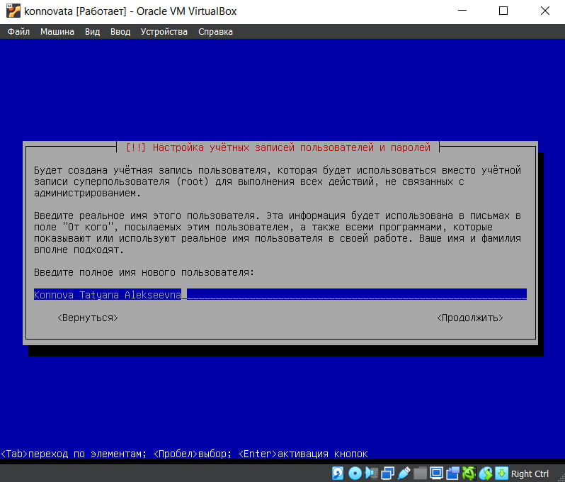
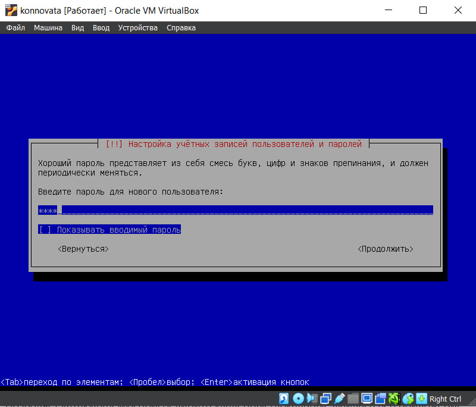
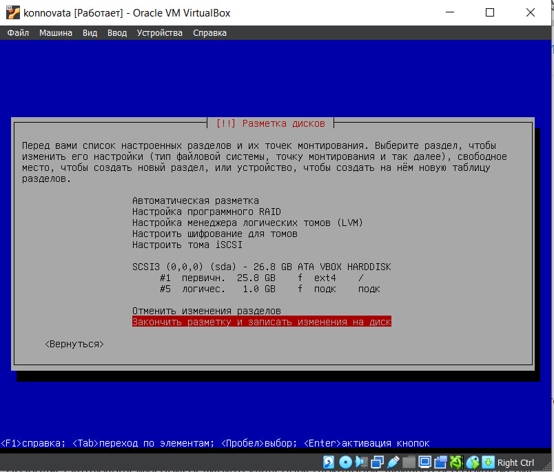

---
## Front matter
lang: ru-RU
title: Индивидуальный проект
subtitle: Этап 1
author:
  - Коннова Т. А.
institute:
  - Российский университет дружбы народов, Москва, Россия
date: 01 марта 2024

## i18n babel
babel-lang: russian
babel-otherlangs: english

## Formatting pdf
toc: false
toc-title: Содержание
slide_level: 2
aspectratio: 169
section-titles: true
theme: metropolis

## I18n babel
babel-lang: russian
babel-otherlangs: english
## Fonts
mainfont: PT Serif
romanfont: PT Serif
sansfont: PT Sans
monofont: PT Mono
mainfontoptions: Ligatures=TeX
romanfontoptions: Ligatures=TeX
sansfontoptions: Ligatures=TeX,Scale=MatchLowercase
monofontoptions: Scale=MatchLowercase,Scale=0.9

header-includes:
 - \metroset{progressbar=frametitle,sectionpage=progressbar,numbering=fraction}
 - '\makeatletter'
 - '\beamer@ignorenonframefalse'
 - '\makeatother'
---

## Докладчик

:::::::::::::: {.columns align=center}
::: {.column width="70%"}

  * Коннова Татьяна Алексеевна
  * студент
  * Российский университет дружбы народов
  * [1132221814@rudn.ru](mailto:kulyabov-ds@rudn.ru)
  * <https://github.com/KONNOVAT/study_2023-2024_osn_infosec>

:::
::: {.column width="30%"}

:::
::::::::::::::

# Вводная часть

## Актуальность

- Kali Linux — GNU/Linux-LiveCD, возникший как результат слияния WHAX и Auditor Security Collection.
- Проект создали Мати Ахарони и Макс Мозер.

## Объект и предмет исследования

- Предназначен прежде всего для проведения тестов на безопасность.

## Цели и задачи

- Познакомиться с данным дистрибутивом, создать учетную запись в нем.

# Выполнение лабораторной работы

## Скачивание

- Для начала скачаем образ диска Kali Linux.

## Работа в ВМ
- Затем в виртуальной машине создадим новое пространство и поместим туда новый образ диска Kali

{#fig:002 width=90%}

## Настройка системы
- Далее запустим окружение и начнем настраивать систему - выберем язык интерфейса - русский.

{#fig:003 width=90%}

## Настройка
- Затем введем новое имя пользователя - Konnova Tatyana Alekseevna

{#fig:004 width=90%}

## Настройка
- Введем имя учетной записи

{#fig:005 width=90%}

## Настройка
- Зададим пароль

{#fig:006 width=90%}

## Настройка
- Настроим время и часовой пояс

{#fig:007 width=90%}

## Разметка памяти
- Разметим диски

{#fig:008 width=90%}

- Выберем для разметки HARDDISK 26.8 GB

{#fig:009 width=90%}

- Выберем автоматическую разметку и запишем изменения на диск

{#fig:010 width=90%}

## Настройка
- Проведем настройку grub-pc

{#fig:011 width=90%}

## Настройка имени системы по заданию
- Откроем терминал, поменяем в файле /etc/hostname имя системы на root
{#fig:012 width=90%}

## Вывод
- Мы научились создавать учетную запись в ОС Kali Linux и первоначально настраивать ее

## Заключение
- Спасибо за внимание!