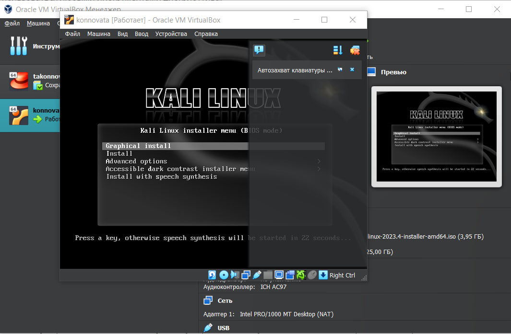
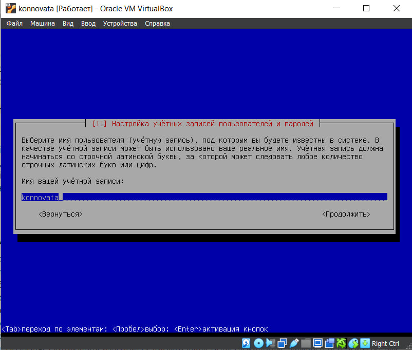
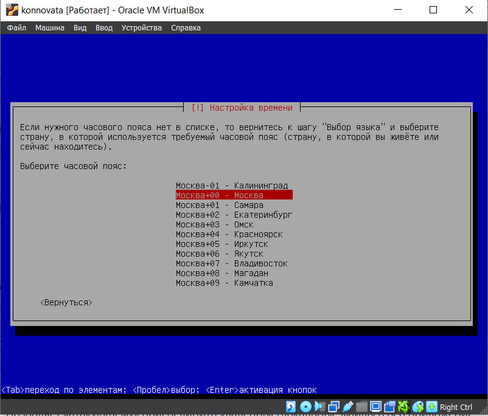
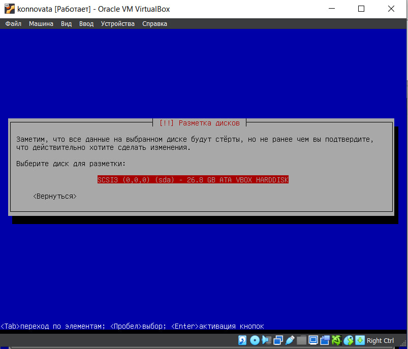
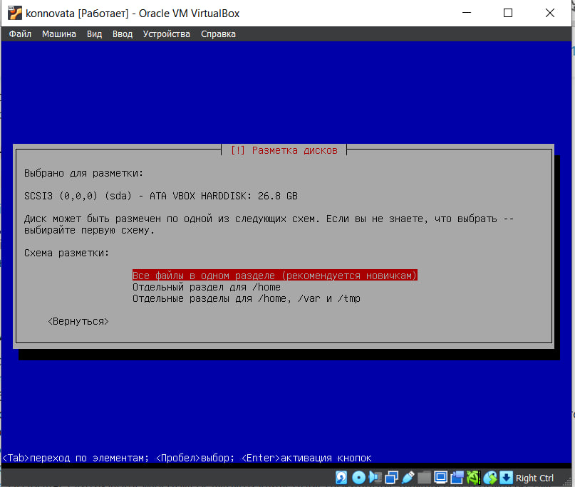
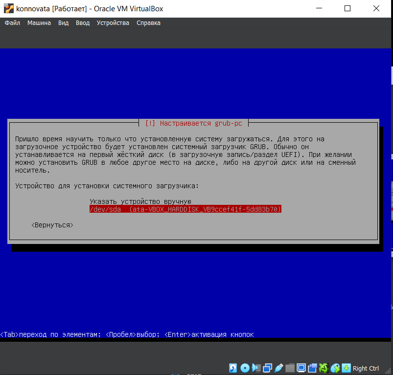
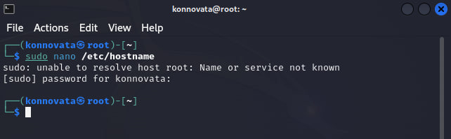

---
## Front matter
title: "Этап 1"
subtitle: "Индивидуальный проект"
author: "Коннова Татьяна Алексеевна"

## Generic otions
lang: ru-RU
toc-title: "Содержание"

## Bibliography
bibliography: bib/cite.bib
csl: pandoc/csl/gost-r-7-0-5-2008-numeric.csl

## Pdf output format
toc: true # Table of contents
toc-depth: 2
lof: true # List of figures
lot: true # List of tables
fontsize: 12pt
linestretch: 1.5
papersize: a4
documentclass: scrreprt
## I18n polyglossia
polyglossia-lang:
  name: russian
  options:
	- spelling=modern
	- babelshorthands=true
polyglossia-otherlangs:
  name: english
## I18n babel
babel-lang: russian
babel-otherlangs: english
## Fonts
mainfont: PT Serif
romanfont: PT Serif
sansfont: PT Sans
monofont: PT Mono
mainfontoptions: Ligatures=TeX
romanfontoptions: Ligatures=TeX
sansfontoptions: Ligatures=TeX,Scale=MatchLowercase
monofontoptions: Scale=MatchLowercase,Scale=0.9
## Biblatex
biblatex: true
biblio-style: "gost-numeric"
biblatexoptions:
  - parentracker=true
  - backend=biber
  - hyperref=auto
  - language=auto
  - autolang=other*
  - citestyle=gost-numeric
## Pandoc-crossref LaTeX customization
figureTitle: "Рис."
tableTitle: "Таблица"
listingTitle: "Листинг"
lofTitle: "Список иллюстраций"
lotTitle: "Список таблиц"
lolTitle: "Листинги"
## Misc options
indent: true
header-includes:
  - \usepackage{indentfirst}
  - \usepackage{float} # keep figures where there are in the text
  - \floatplacement{figure}{H} # keep figures where there are in the text
---

# Цель работы

Установить дистрибутив Kali Linux с помощью Virtual Box

# Задание

Установите дистрибутив Kali Linux в виртуальную машину.
В качестве среды виртуализации предлагается использовать VirtualBox.

# Теоретическое введение

Первый этап - подготовка ПО к работе, установка дистрибутива.

Например, в табл. [-@tbl:std-dir] приведено краткое описание стандартных каталогов Unix.

: Описание некоторых каталогов файловой системы GNU Linux {#tbl:std-dir}

| Имя каталога | Описание каталога                                                                                                          |
|--------------|----------------------------------------------------------------------------------------------------------------------------|
| `/`          | Корневая директория, содержащая всю файловую                                                                               |
| `/bin `      | Основные системные утилиты, необходимые как в однопользовательском режиме, так и при обычной работе всем пользователям     |
| `/etc`       | Общесистемные конфигурационные файлы и файлы конфигурации установленных программ                                           |
| `/home`      | Содержит домашние директории пользователей, которые, в свою очередь, содержат персональные настройки и данные пользователя |
| `/media`     | Точки монтирования для сменных носителей                                                                                   |
| `/root`      | Домашняя директория пользователя  `root`                                                                                   |
| `/tmp`       | Временные файлы                                                                                                            |
| `/usr`       | Вторичная иерархия для данных пользователя                                                                                 |

Более подробно про Unix см. в [@tanenbaum_book_modern-os_ru; @robbins_book_bash_en; @zarrelli_book_mastering-bash_en; @newham_book_learning-bash_en].

# Выполнение лабораторной работы

Для начала скачаем образ диска Kali Linux (рис. [-@fig:001]).

{#fig:001 width=90%}

Затем в виртуальной машине создадим новое пространство и поместим туда новый образ диска Kali

{#fig:002 width=90%}

Далее запутим окружение и начнем настраивать систему - выберем язык интерфейса - русский.

{#fig:003 width=90%}

Затем введем новое имя пользователя - Konnova Tatyana Alekseevna

{#fig:004 width=90%}

Введем имя учетной записи

{#fig:005 width=90%}

Зададим пароль

{#fig:006 width=90%}

Настроим время и часовой пояс

{#fig:007 width=90%}

Разметим диски

{#fig:008 width=90%}

Выберем для разметки HARDDISK 26.8 GB

{#fig:009 width=90%}

Выберем автоматическую разметку и запишем изменения на диск

{#fig:010 width=90%}

Проведем настройку grub-pc

{#fig:011 width=90%}

Откроем терминал, поменяем в файле /etc/hostname имя системы на root

{#fig:012 width=90%}

# Выводы

В ходе выполнения работы мы узнали основы работы с Kali Linux, создали учетную запись.

# Список литературы{.unnumbered}

::: {#refs}
:::
