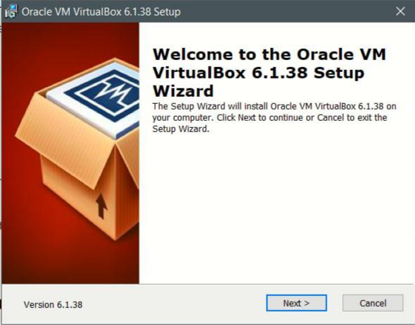

---
## Front matter
lang: ru-RU
title: Лабораторная 1
subtitle: Простейший шаблон
author:
  -Татьяна Коннова
institute:
  - Российский университет дружбы народов, Москва, Россия
date: 17.02.2024

## i18n babel
babel-lang: russian
babel-otherlangs: english

## Formatting pdf
toc: false
toc-title: Содержание
slide_level: 2
aspectratio: 169
section-titles: true
theme: metropolis
header-includes:
 - \metroset{progressbar=frametitle,sectionpage=progressbar,numbering=fraction}
 - '\makeatletter'
 - '\beamer@ignorenonframefalse'
 - '\makeatother'
---

# Информация

## Докладчик

:::::::::::::: {.columns align=center}
::: {.column width="70%"}

  * Коннова Т. А.
  * Российский университет дружбы народов
  * [1132221814@rudn.ru](mailto:1132221814@rudn.ru)


:::
::: {.column width="30%"}


# Вводная часть

## Актуальность

- Важно донести результаты своих исследований до окружающих
- Научная презентация --- рабочий инструмент исследователя
- Необходимо создавать презентацию быстро
- Желательна минимизация усилий для создания презентации

## Объект и предмет исследования

- Презентация как текст
- Программное обеспечение для создания презентаций
- Входные и выходные форматы презентаций

## Цели и задачи

- Создать шаблон презентации в Markdown
- Описать алгоритм создания выходных форматов презентаций

## Материалы и методы

- Процессор `pandoc` для входного формата Markdown
- Результирующие форматы
	- `pdf`
	- `html`
- Автоматизация процесса создания: `Makefile`

# Создание презентации

## Процессор `pandoc`

- Pandoc: преобразователь текстовых файлов
- Сайт: <https://pandoc.org/>
- Репозиторий: <https://github.com/jgm/pandoc>

## Формат `pdf`

- Использование LaTeX
- Пакет для презентации: [beamer](https://ctan.org/pkg/beamer)
- Тема оформления: `metropolis`

## Код для формата `pdf`

```yaml
slide_level: 2
aspectratio: 169
section-titles: true
theme: metropolis
```

## Формат `html`

- Используется фреймворк [reveal.js](https://revealjs.com/)
- Используется [тема](https://revealjs.com/themes/) `beige`

## Код для формата `html`

- Тема задаётся в файле `Makefile`

```make
REVEALJS_THEME = beige 
```

# Элементы презентации

## Актуальность
Данная тема лабораторной работы однозначно является актуально, так как установка виртуальной машины и работа на ней являются основополагающими этапами курса


## Цели и задачи

Установить виртуальную машину, провести повторение полученных знаний

## Материалы и методы

https://github.com/yamadharma/course-directory-student-template


## Шаг 1   


Так как в первом семестре наша группа устанавливала виртуальную машину и ряд дистрибутивов, то в этой лабораторной работе я предполагаю взятие скринов именно из моей первосеместровой работы.
Начинаем устанавливать виртуальную машину 
1) Установка VirtualBox. Так как дальнейшие лабораторные работы будут
производиться мною на своем компьютере, то я устанавливаю виртуальную машину,
чтобы в последующем установить на нее OS Linux.



:::
::::::::::::::

