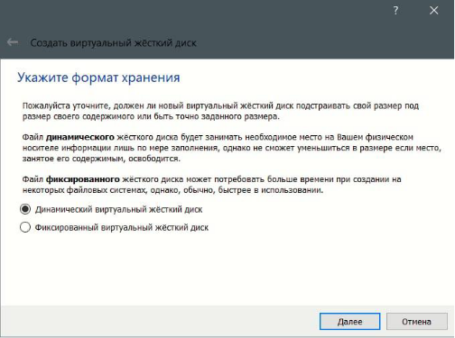

---
## Front matter
title: "Установка ОС Linux."
subtitle: "НПИбд-01-22"
author: "Коннова Татьяна Алексеевна"

## Generic otions
lang: ru-RU
toc-title: "Содержание"

## Bibliography
bibliography: bib/cite.bib
csl: pandoc/csl/gost-r-7-0-5-2008-numeric.csl

## Pdf output format
toc: true # Table of contents
toc-depth: 2
lof: true # List of figures
lot: true # List of tables
fontsize: 12pt
linestretch: 1.5
papersize: a4
documentclass: scrreprt
## I18n polyglossia
polyglossia-lang:
  name: russian
  options:
	- spelling=modern
	- babelshorthands=true
polyglossia-otherlangs:
  name: english
## I18n babel
babel-lang: russian
babel-otherlangs: english
## Fonts
mainfont: PT Serif
romanfont: PT Serif
sansfont: PT Sans
monofont: PT Mono
mainfontoptions: Ligatures=TeX
romanfontoptions: Ligatures=TeX
sansfontoptions: Ligatures=TeX,Scale=MatchLowercase
monofontoptions: Scale=MatchLowercase,Scale=0.9
## Biblatex
biblatex: true
biblio-style: "gost-numeric"
biblatexoptions:
  - parentracker=true
  - backend=biber
  - hyperref=auto
  - language=auto
  - autolang=other*
  - citestyle=gost-numeric
## Pandoc-crossref LaTeX customization
figureTitle: "Рис."
tableTitle: "Таблица"
listingTitle: "Листинг"
lofTitle: "Список иллюстраций"
lolTitle: "Листинги"
## Misc options
indent: true
header-includes:
  - \usepackage{indentfirst}
  - \usepackage{float} # keep figures where there are in the text
  - \floatplacement{figure}{H} # keep figures where there are in the text
---

# Цель работы

Целью данной работы является приобретение практических навыков установки операционной системы на виртуальную машину, настройки минимально необходимых для дальнейшей работы сервисов.

# Задание
Создать и настроить виртуальную машину, установить ряд дистрибутивов.

# Выполнение лабораторной работы

Так как в первом семестре наша группа устанавливала виртуальную машину и ряд дистрибутивов, то в этой лабораторной работе я предполагаю взятие скринов именно из моей первосеместровой работы.
Начинаем устанавливать виртуальную машину 
1) Установка VirtualBox. Так как дальнейшие лабораторные работы будут
производиться мною на своем компьютере, то я устанавливаю виртуальную машину,
чтобы в последующем установить на нее OS Linux. (рис. [-@fig:001]) (рис. [-@fig:002]) (рис. [-@fig:003])

{ #fig:001 width=70% }

{ #fig:002 width=70% }

{ #fig:003 width=70% }
 
## Настройка виртуальной машины
Для того, чтобы соблюсти соглашение об именовании, мы создаем
необходимую подпапку с именем студента. Так как планируемый дистрибутив
для Linux— Fedora, его и выбираем. (рис. [-@fig:004]) 

{ #fig:004 width=70% }

Выбираем объем памяти, а также создаем новый виртуальный жесткий диск (рис. [-@fig:005])  (рис. [-@fig:006]) 
  
{ #fig:005 width=70% }

{ #fig:006 width=70% }

Выбираем тип VDI (рис. [-@fig:007])

{ #fig:007 width=70% }

Выбираем формат хранения (рис. [-@fig:008])

{ #fig:008 width=70% }

Увеличиваем объем видеопамяти до 128МБ (рис. [-@fig:009])

{ #fig:009 width=70% }

На данном этапе выбираем необходимый размер файла — 80 ГБ, задаем ему имя. (рис. [-@fig:011]) 

{ #fig:011 width=70% }   

## 3) Установка дистрибутива Fedora 36

Скачиваем с сайта https://getfedora.org/ru/workstation/download/ образ (рис. [-@fig:111])

{ #fig:111 width=70% }

Меняем виртуальный оптический привод, выставляем вторичное устройство,
проверяем его папку (рис. [-@fig:012])

{ #fig:012 width=70% }

Меняем хост-клавишу на комбинацию левый Ctrl+ левый Alt (рис. [-@fig:013])

{ #fig:013 width=70% }

Наконец, запускаем Fedora-36 (рис. [-@fig:014])

{ #fig:014 width=70% }  

Так как метод, описанный в конспекте лабораторной работы у меня не
получился(возможно, из-за разницы методик версий), я изъяла оптический привод до
того, как начать работу с Fedora, а затем перезапустила Fedora (рис. [-@fig:067])

{ #fig:067 width=70% }

Меняем язык настроек, место установки автоматически, предлагаемый диск нас
устраивает. (рис. [-@fig:015])

{ #fig:015 width=70% } 

Fedora готова к работе  (рис. [-@fig:016])

{ #fig:016 width=70% }  

Перезапускаем Fedora (рис. [-@fig:017])

{ #fig:017 width=70% } 

Оставляем настройки конфиденциальности без изменени (рис. [-@fig:019])

{ #fig:019 width=70% }

Настраиваем пароль, подтверждаем его
(рис. [-@fig:020])

{ #fig:020 width=70% }

Fedora готова к работе
(рис. [-@fig:021])

{ #fig:021 width=70% }

(рис. [-@fig:022])

{ #fig:001 width=70% }{ #fig:022 width=70% }

(рис. [-@fig:023])

{ #fig:023 width=70% }

(рис. [-@fig:024])

{ #fig:024 width=70% }

(рис. [-@fig:025])

{ #fig:025 width=70% }

(рис. [-@fig:026])

{ #fig:026 width=70% }

(рис. [-@fig:027])

{ #fig:027 width=70% }

(рис. [-@fig:028])

{ #fig:028 width=70% } 

Установим pandoc and texlive(он установлен в ходе выполнения первосеместровой лабораторной номер 1)
    Запускаем терминальный мультиплексор tmux:

    tmux

    Переключитесь на роль супер-пользователя:

    sudo -i

рandoc

    Установим pandoc:

         dnf -y install pandoc

    Установим необходимые расширения(ошибка, возникшая у меня из-за невыполнения этой команды ранее):

        pip install pandoc-fignos pandoc-eqnos pandoc-tablenos pandoc-secnos --user
    
    (рис. [-@fig:030])

{ #fig:030 width=70% }  
    

texlive

    Установим дистрибутив TeXlive:

            dnf -y install texlive texlive

(рис. [-@fig:029])

{ #fig:029 width=70% }  

## Самостоятельная работа 
ОТВЕТЫ НА ДОМАШНЕЕ ЗАДАНИЕ И ВОПРОСЫ:

1)
    Какую информацию содержит учётная запись пользователя?
    
    
    Логин и пароль
    
    
2)
    Укажите команды терминала и приведите примеры:
для получения справки по команде;

       -help 
       
       
пример:

    wget -help
    
    
для перемещения по файловой системе;

       cd 
       
       
пример:

       cd /home
       
        
для просмотра содержимого каталога;

       ls /takonnova
       
       
        
для определения объёма каталога;

       du
       
       
пример:

       sudo du -h /home
       
       
для создания / удаления каталогов / файлов;
       
       
создание файла

       touch
       
       
пример:

       touch ~/folder/rsm.txt
       
       
создание папки

    mkdir
    
    
пример:

    mkdir ~/folder2345/fokder_new_gu
    
    
    
    
удалить файл

    rm 
    
    
пример:

    rm ~/fokl/gfi.txt
    
    
удалить папку

    rm -r
    
    
пример:

    rm -r ~/fghj/tyhtr.txt
    
    
для задания определённых прав на файл / каталог;

    chmod 
    
    
пример:

    chmod d-w fikrijvfghjb.txt
    
    
для просмотра истории команд.

    history

3)Что такое файловая система? Приведите примеры с краткой характеристикой.

    Файловая система -  часть операционной системы, обеспечивающая запись и чтение файлов на дисковых носителях. Пример это FAT, NFTS for Windows,  Extended Filesystem for Linux.
    
    
4)Как посмотреть, какие файловые системы подмонтированы в ОС?

    findmnt
    
    
5)Как удалить зависший процесс?

    kill 

# Выводы
Мы приобрели практические навыки установки операционной системы на виртуальную машину, сделали настройки минимально необходимых для дальнейшей работы сервисов.

::: {#refs}
:::
