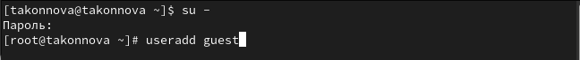
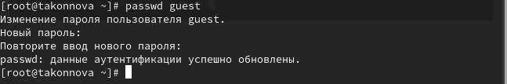
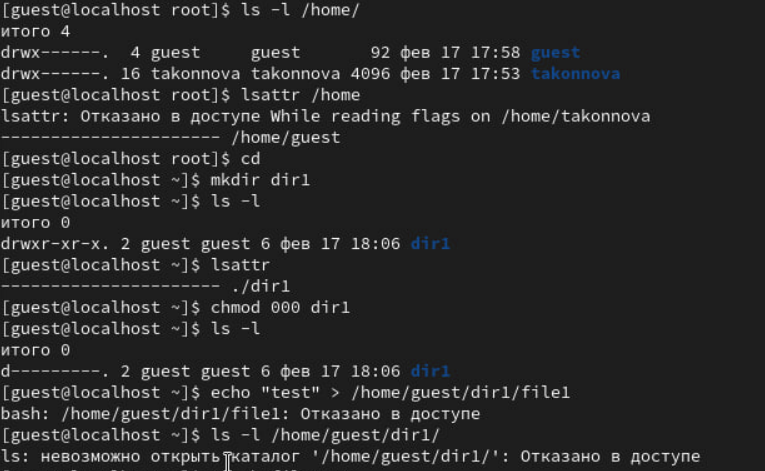

---
## Front matter
lang: ru-RU
title: Основы информационной безопасности
subtitle: Лабораторная работа №2
author:
  - Коннова Т. А.
institute:
  - Российский университет дружбы народов, Москва, Россия
date: 02 марта 2024

## i18n babel
babel-lang: russian
babel-otherlangs: english

## Formatting pdf
toc: false
toc-title: Содержание
slide_level: 2
aspectratio: 169
section-titles: true
theme: metropolis

## I18n babel
babel-lang: russian
babel-otherlangs: english
## Fonts
mainfont: PT Serif
romanfont: PT Serif
sansfont: PT Sans
monofont: PT Mono
mainfontoptions: Ligatures=TeX
romanfontoptions: Ligatures=TeX
sansfontoptions: Ligatures=TeX,Scale=MatchLowercase
monofontoptions: Scale=MatchLowercase,Scale=0.9

header-includes:
 - \metroset{progressbar=frametitle,sectionpage=progressbar,numbering=fraction}
 - '\makeatletter'
 - '\beamer@ignorenonframefalse'
 - '\makeatother'
---

## Докладчик

:::::::::::::: {.columns align=center}
::: {.column width="70%"}

  * Коннова Татьяна Алексеевна
  * студент
  * Российский университет дружбы народов
  * [1132221814@rudn.ru](mailto:kulyabov-ds@rudn.ru)
  * <https://github.com/KONNOVAT/study_2023-2024_osn_infosec>

:::
::: {.column width="30%"}

:::
::::::::::::::

# Вводная часть

## Цель работы

- Получение практических навыков работы в консоли с атрибутами файлов, закрепление теоретических основ дискреционного 
разграничения доступа в современных системах с открытым кодом на базе ОС Linux

# Выполнение лабораторной работы

## Выполнение лабораторной работы
В установленной при выполнении предыдущей лабораторной работы
операционной системе создаем учётную запись пользователя guest (использую учётную запись администратора):
useradd guest (рис. [-@fig:001]).

{#fig:001 width=90%}

## Выполнение лабораторной работы
Затем задаем пароль для пользователя guest (использую учётную запись администратора):
passwd guest

{#fig:002 width=90%}

## Выполнение лабораторной работы
Войдем в систему от имени пользователя guest. Определим директорию, в которой находимся, командой pwd. 
Сравним её с приглашением командной строки. 
Определим, является ли она нашей домашней директорией? Да. 
Уточним имя нашего пользователя командой whoami

{#fig:003 width=60%}

## Выполнение лабораторной работы
Определим существующие в системе директории командой
ls -l /home/
Удалось ли нам получить список поддиректорий директории /home?
Да

Какие права установлены на директориях?
Права на чтение, запись и исполнение. 

Проверим, какие расширенные атрибуты установлены на поддиректориях, находящихся в директории /home, командой:
lsattr /home
Удалось ли нам увидеть расширенные атрибуты директории?
Да

## Выполнение лабораторной работы
Удалось ли нам увидеть расширенные атрибуты директорий других
пользователей?
Нет

Создадим в домашней директории поддиректорию dir1 командой
mkdir dir1

Определим командами ls -l и lsattr, какие права доступа и расширенные атрибуты были выставлены на директорию dir1.
Никакие права доступа. 

Снимем с директории dir1 все атрибуты командой
chmod 000 dir1
и проверим с её помощью правильность выполнения команды
ls -l

## Выполнение лабораторной работы
Попытаемся создать в директории dir1 файл file1 командой
echo "test" > /home/guest/dir1/file1

Объясним, почему мы получили отказ в выполнении операции по созданию файла
Потому что мы ограничили права на эту директорию, отменили права на запись, чтение, исполнение

Оценим, как сообщение об ошибке отразилось на создании файла - проверим это командой
ls -l /home/guest/dir1
Следующая команда была отклонена.

{#fig:004 width=90%}

## Вывод
- Получили практические навыков работы в консоли с атрибутами файлов, закрепили теоретических основ дискреционного 
разграничения доступа в современных системах с открытым кодом на базе ОС Linux

## Заключение
- Спасибо за внимание!