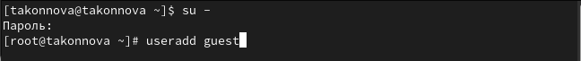
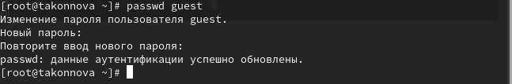
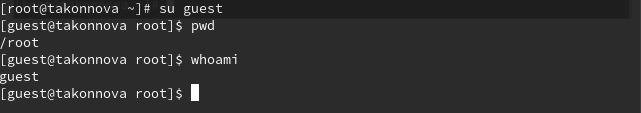
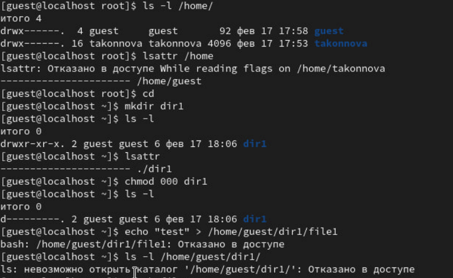

---
## Front matter
title: "Лабораторная работа №2"
subtitle: "НПИбд-01-22"
author: "Татьяна Алексеевна Коннова"

## Generic otions
lang: ru-RU
toc-title: "Содержание"

## Bibliography
bibliography: bib/cite.bib
csl: pandoc/csl/gost-r-7-0-5-2008-numeric.csl

## Pdf output format
toc: true # Table of contents
toc-depth: 2
lof: true # List of figures
lot: true # List of tables
fontsize: 12pt
linestretch: 1.5
papersize: a4
documentclass: scrreprt
## I18n polyglossia
polyglossia-lang:
  name: russian
  options:
	- spelling=modern
	- babelshorthands=true
polyglossia-otherlangs:
  name: english
## I18n babel
babel-lang: russian
babel-otherlangs: english
## Fonts
mainfont: PT Serif
romanfont: PT Serif
sansfont: PT Sans
monofont: PT Mono
mainfontoptions: Ligatures=TeX
romanfontoptions: Ligatures=TeX
sansfontoptions: Ligatures=TeX,Scale=MatchLowercase
monofontoptions: Scale=MatchLowercase,Scale=0.9
## Biblatex
biblatex: true
biblio-style: "gost-numeric"
biblatexoptions:
  - parentracker=true
  - backend=biber
  - hyperref=auto
  - language=auto
  - autolang=other*
  - citestyle=gost-numeric
## Pandoc-crossref LaTeX customization
figureTitle: "Рис."
tableTitle: "Таблица"
listingTitle: "Листинг"
lofTitle: "Список иллюстраций"
lotTitle: "Список таблиц"
lolTitle: "Листинги"
## Misc options
indent: true
header-includes:
  - \usepackage{indentfirst}
  - \usepackage{float} # keep figures where there are in the text
  - \floatplacement{figure}{H} # keep figures where there are in the text
---

# Цель работы

Получение практических навыков работы в консоли с атрибутами файлов, закрепление теоретических основ дискреционного разграничения доступа в современных системах с открытым кодом на базе ОС Linux

Более подробно про разграничение доступа см. в [@infosec].

# Выполнение лабораторной работы

В установленной при выполнении предыдущей лабораторной работы
операционной системе создаем учётную запись пользователя guest (использую учётную запись администратора):
useradd guest (рис. [-@fig:001]).

{#fig:001 width=90%}

Затем задаем пароль для пользователя guest (использую учётную запись администратора):
passwd guest

{#fig:002 width=90%}

Войдем в систему от имени пользователя guest. Определим директорию, в которой находимся, командой pwd. 
Сравним её с приглашением командной строки. 
Определим, является ли она нашей домашней директорией? Да. 
Уточним имя нашего пользователя командой whoami

{#fig:003 width=60%}

Определим существующие в системе директории командой
ls -l /home/
Удалось ли нам получить список поддиректорий директории /home?
Да

Какие права установлены на директориях?
Права на чтение, запись и исполнение. 

Проверим, какие расширенные атрибуты установлены на поддиректориях, находящихся в директории /home, командой:
lsattr /home
Удалось ли нам увидеть расширенные атрибуты директории?
Да

Удалось ли нам увидеть расширенные атрибуты директорий других
пользователей?
Нет

Создадим в домашней директории поддиректорию dir1 командой
mkdir dir1

Определим командами ls -l и lsattr, какие права доступа и расширенные атрибуты были выставлены на директорию dir1.
Никакие права доступа. 

Снимем с директории dir1 все атрибуты командой
chmod 000 dir1
и проверим с её помощью правильность выполнения команды
ls -l

Попытаемся создать в директории dir1 файл file1 командой
echo "test" > /home/guest/dir1/file1

Объясним, почему мы получили отказ в выполнении операции по созданию файла
Потому что мы ограничили права на эту директорию, отменили права на запись, чтение, исполнение

Оценим, как сообщение об ошибке отразилось на создании файла - проверим это командой
ls -l /home/guest/dir1
Следующая команда была отклонена.

{#fig:004 width=90%}

: Установленные права и разрешенные действия {#tbl:1} 

| Права файла и директории | Создание файла | Удаление файла | Запись в файл | Чтение файла | Смена директории | Просмотр файлов в директории | Переименование файла | Смена атрибутов файла |
|--------------------------|----------------|----------------|---------------|--------------|------------------|------------------------------|----------------------|-----------------------|
| 000                      | -              | -              | -             | -            | +                | -                            | -                    | +                     |
| 200                      | -              | -              | -             | -            | -                | -                            | -                    | -                     |
| 300                      | +              | -              | +             | -            | +                | -                            | +                    | +                     |
| 400                      | -              | -              | -             | -            | -                | +                            | -                    | -                     |
| 500                      | -              | -              | -             | +            | +                | +                            | -                    | +                     |
| 600                      | -              | -              | -             | -            | +                | +                            | -                    | -                     |
| 700                      | +              | +              | +             | +            | +                | +                            | +                    | +                     |

Исходя из таблицы, заполненной выше, определим минимально необходимые права для совершения
операций, заполним таблицу [-@tbl:2]

: Минимальные права для совершения операций {#tbl:2} 

| Операция               | Минимальные права на директорию | Минимальные права на файл |
|------------------------|---------------------------------|---------------------------|
| Создание файла         | 300                             | 200                       |
| Удаление файла         | 300                             | 200                       |
| Чтение файла           | 500                             | 400                       |
| Запись в файл          | 300                             | 200                       |
| Переименование файла   | 300                             | 200                       |
| Создание поддиректории | 300                             | 300                       |
| Удаление поддиректории | 300                             | 300                       |

# Выводы

В ходе выполнения работы мы получили практические навыки работы в консоли с атрибутами файлов, закрепили теоретические основы дискреционного разграничения доступа в современных системах с открытым кодом на базе ОС Linux1.

# Список литературы{.unnumbered}

::: {#refs}
:::
